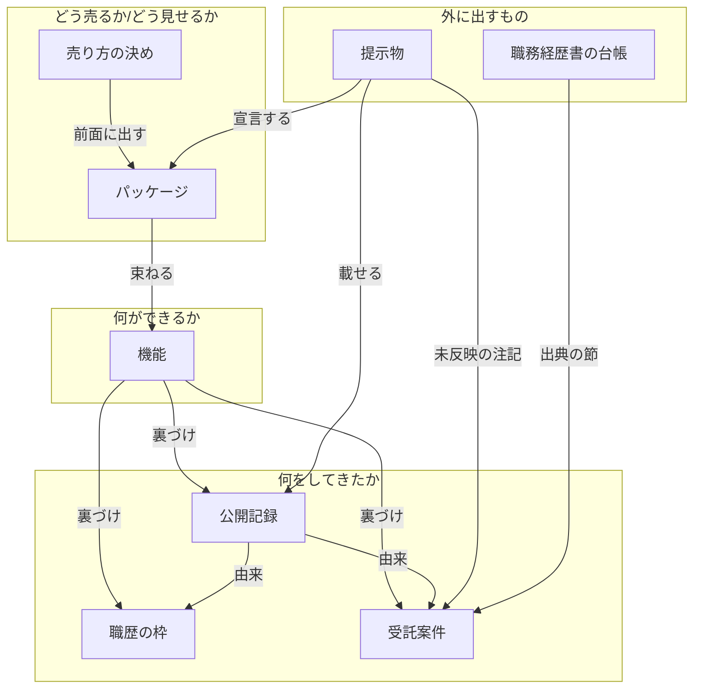

# accord

accord は、職務経歴書やプロフィールを AI と一緒に作るときに、その元になる経歴の記録と、そこから作る文書とを食い違わせないための、手元で動く MCP サーバーです。

フリーランスの案件や転職に応募するとき、職務経歴書は 1 通あれば足りると思いがちです。しかし、エンジニアとして応募するときと、プロジェクトマネージャとして応募するときでは、同じ経歴でも前面に出す部分や並べ方が違います。accord は、今回はどの側面で経歴をまとめるかを日付つきで記録し、そこから作る文書に、経歴に無い実績や古い売り文句が混ざっていないかを、出す前に確かめます。よい職務経歴書を書くためのプロンプトやエージェントではありません。

> **English:** One résumé rarely fits every application: applying as an engineer and applying as a project manager call for different parts of the same history, in a different order. accord is a local MCP server that keeps the underlying career record consistent while you build résumés and profiles with an AI. It is not a prompt or an agent for writing good résumés. It records which facet you are presenting now, and catches unsupported claims and stale pitches before they go out. Run it with `uv sync`, `uv run pytest`, `uv run accord --list`. The rest of this document is written in Japanese.

## 何をする道具か

経歴の元データは、3 種類の Markdown に分けて持ちます。

- 何ができるか（スキルの一覧）
- 何をしてきたか（職歴や案件の実績）
- どう売るか/どう見せるか（スキルをどう組み合わせて、誰向けに何を前面に出すか。この組み合わせを、この README ではパッケージと呼びます）

困るのは、売り込み方（いまどの側面を前面に出すか。ツール名では positioning）を変えたときです。「今月からプロジェクトマネージャの仕事を前面に出す」と決めても、その決定は会話の中で終わってどこにも残りません。結果として、パッケージの説明が 1 か月前のまま放置されたり、もう前面に出していないパッケージを名乗ったプロフィールが何枚も残ったりします。ルールとしては書いてあるのに、文章を書くその瞬間には思い出せません。

accord は、そのルールを「読んで覚えておくもの」から「書く瞬間に返ってくるもの」に変えます。文章そのものは書きません。書くのは人か AI で、accord がするのは材料を渡すことと、食い違いをその場で止めることです。使い方は 2 通りで、Claude などの AI から MCP 経由で呼ぶか、自分で Python から呼んで手元のファイルを検査します。

ツールの引数や戻り値に出てくる ID は、経歴の項目 1 つ 1 つに付ける短い名前です（詳しくは下の「データの型とルール」）。

| ツール | 何をするか |
|---|---|
| `get_positioning` | いまの売り込み方（何を前面に出しているか）を返す。まだ記録が無ければ「先に記録してください」と返す |
| `assemble_material` | 媒体（転職サイトやマッチングサービス）向けの文章を書くための材料をまとめて返す。中身は、いまの売り込み方、前面に出すパッケージの説明、その根拠になる実績の本文、その媒体の書き方の決まり（文字数など）、使わないと決めた言い回し。公開できない実績は除き、除いたことを知らせる |
| `record_positioning` | 「今日から何を前面に出すか」を日付つきで記録する。必須の項目が欠けていれば、欠けた項目と書き方の例を返して書き込まない |
| `register_capability` | できることの一覧に 1 行足す。ID が形式に合わないか既に使われているか、根拠にした実績や公開記録の ID が実在しなければ、近い候補を返して書き込まない。分類が設定に無い語のときも同じで、手で書いた行に設定に無い分類が残っていれば検査でも挙げる |
| `register_public_record` | 公開記録（登壇・記事・リポジトリなど、外から確かめられる成果物）を 1 件記録する。必須の項目が欠けていたり、ID が形式に合わないか既に使われていたり、種類や役割が設定に無い語だったり、元になった仕事の ID が実在しなければ、書き込まずに次の一手を返す |
| `revise_package` | パッケージ（スキルの組み合わせ）の説明を更新し、更新日を進める。一覧に無いスキルの ID を組み合わせに入れると、近いものを候補として返して書き込まない |
| `check_consistency` | 全ファイルをルールに照らし、食い違いを「どのファイルのどこを、何に合わせるか」つきで一覧にする |
| 資源 `accord://ontology` | データの型とルールの定義を、AI が読める形で返す。AI がセッションの最初に読んで前提を揃えるためのもので、利用者が何かする必要はない |

書き込む 4 つのツールは、ルールに通った入力だけを書き、通らない入力は書かずに「次に何をすればよいか」を返します。読むだけのツールと検査は、ファイルを一切変えません。

## 動くとこうなる

同梱の架空のサンプルデータ（`samples/`）のプロフィール 1 枚を、わざと古いパッケージ名を名乗った状態にして検査を呼ぶと、次の 1 件が返ります。出力の文は正本のファイルで使う短い呼び名で書かれていて、「看板」は前面に出しているパッケージ、「束」はパッケージ、「提示物」はプロフィールなどの文章のことです。

```json
{
  "constraint": "提示物の宣言と看板の一致",
  "file": "presentations/tsukikusa/profile.md",
  "location": "「宣言する束」の行",
  "expected": "いまの看板は「requirements-and-progress（要件定義と進行管理）」（2026-09-10 の決め・適用範囲 全体）で、この文面は「data-platform-setup（データの置き場づくり）」を名乗っている。宣言する束を看板の ID に書き換える。この文面だけ合わせない理由があるなら、決めの「例外」欄にこのファイル名と理由を書く。",
  "candidates": ["requirements-and-progress"]
}
```

書き込みを断るときも同じ形で、断った理由と、次に呼ぶ操作・欠けた項目・書き方の例が返ります。

Python から直接呼ぶなら次の形です。

```python
from pathlib import Path
from accord.vocabulary.settings import load_settings
from accord.services.consistency import ConsistencyService

settings = load_settings(Path("samples/accord.toml"))
report = ConsistencyService(settings).inspect()   # 範囲を省くと全体
for v in report.violations:
    print(v.constraint, v.file, v.expected)
```

## 動かしてみる

Python 3.12 以上と [uv](https://docs.astral.sh/uv/) が必要です。架空の人物と架空の案件で作ったサンプルデータを同梱しているので、設定なしでそのまま動きます。

```
uv sync                # 依存パッケージを入れる
uv run pytest          # テストが通ることを確かめる
uv run accord --list   # ツール 7 つと資源 1 つの名前を表示する
```

引数なしで `uv run accord` を実行すると、標準入出力で MCP サーバーとして起動します。画面には何も出ませんが、それで正常です（AI 側からの接続を待っています）。ネットワークは使いません。

## 自分のデータで使う

`samples/accord.toml` をコピーして書き換え、起動時に指定します。設定ファイルに書くのは、Markdown の置き場と、自分の言葉（媒体の名前、スキルの分類、パッケージの状態を表す語。たとえば「仮説のみ・検証中・実績あり」）です。

起動のしかたは 2 通りあります。**手元に置いた accord をそのまま動かす**なら、次の形です。`--project` で指した場所のソースが毎回そのまま動くので、accord のコードを直したら次の起動から反映されます。手元で直しながら使うなら、こちらを選んでください。

```
uv run --project /path/to/accord accord --config /path/to/your/accord.toml
```

**版を固定して入れて使う**なら、次の形です。

```
uvx --from /path/to/accord accord --config /path/to/your/accord.toml
```

こちらには落とし穴があります。`uvx` は指したパスから組み立てた環境を version（`pyproject.toml` に書いた版番号）で覚えるので、版を上げないかぎり、ソースを直しても前の版が動き続けます（`--refresh` や `--reinstall` を付けても戻りません）。

Claude Code から使うときは、プロジェクトの `.mcp.json` に次のように書きます。

```json
{
  "mcpServers": {
    "accord": {
      "command": "uv",
      "args": ["run", "--project", "/path/to/accord", "accord", "--config", "/path/to/your/accord.toml"]
    }
  }
}
```

Markdown の形はサンプルを見るのが早く、たとえば売り込み方の記録は次の形です。

```markdown
## 2026-09-10 全体

- 日付: 2026-09-10
- 適用範囲: 全体
- 前面に出す束: requirements-and-progress
- 根拠: 直近 3 件の引き合いが、作る前の整理と、決まったことを進める役の不在に集中していたため。
- 例外: なし
```

自分の Markdown の書き方がサンプルと違っていても、見出しの深さ、項目を箇条書きで書くか表で書くか、項目名の言い換え、を設定の `[reading]` の節で指定すれば、ファイルを書き換えずに読めます。指定できる範囲と書き方は `samples/README.md` にあります。

思ったとおりの結果が出ないときは、`check_consistency` の戻り値の先頭（`provenance`）を見てください。読んだ設定ファイルの場所、適用した読み方の指定、いま動いているソースの置き場と版が出るので、古いままの accord が動いていないかをその場で見分けられます。

## データの型とルール

accord が扱うデータの種類（型）と、型どうしのつながり（関係）と、守らせる決まり（ルール）は、`src/accord/ontology.yaml` という 1 つのファイルにまとめて定めてあります。中身は、型 8 つ、関係 8 種類、ルール 12 つです。関係のうち「裏づけ」は指す先の型が 3 つ（職歴の枠と受託案件と公開記録）、「由来」は 2 つ（職歴の枠と受託案件）あるので、下の図では矢印 11 本になります。Python の型のコードはこのファイルから自動生成し、資源 `accord://ontology` はこのファイルの中身を返します。この節の説明と定義のファイルがずれていないことは、テストで確かめています。



四角が型、矢印が関係です（同じ図を画像にしたものが `docs/ontology.svg` にあります。上の図が描画されない環境ではそちらを見てください）。四角に書いた名前は、ツールの戻り値や検査の結果にそのまま出てきます。矢印は一方向で、逆向き、つまり職歴や案件の側に「これはあのパッケージで使っている」と書き足すことはしません（これがルール「逆参照を書かない」）。下の表の 3 列目は、同梱のサンプルデータで対応するファイルです。自分のデータで使うときは `accord.toml` の `[source.files]` でこの対応を自分のファイル名に置き換えます。

| 型（ツールの出力に出る名前） | 何のこと | サンプルのファイル |
|---|---|---|
| 売り方の決め | いま何を前面に出して売るかを、日付つきで 1 件ずつ書き足す記録。この README で「売り込み方」と呼んでいるものです。 | `samples/source/positioning.md` |
| パッケージ | 機能をいくつか組み合わせて、誰に売るかまで決めた売り物の単位。プロフィールや応募文が名乗るのは、この名前です。 | `samples/source/packages.md` |
| 機能 | 提供できる仕事 1 つ。この README で「スキル」「できること」と呼んでいるもので、「これができる」と言える根拠の節を必ず持ちます。 | `samples/source/capabilities.md` |
| 職歴の枠 | 会社 1 社ぶん、またはフリーランス 1 期ぶんの職歴。 | `samples/source/career.md` |
| 受託案件 | クライアント 1 社ぶんの仕事、または複数の案件にまたがる 1 つの話題。職歴の枠と並ぶ、実績の側のファイルです。 | `samples/source/engagements.md` |
| 公開記録 | 外から確かめられる公開の成果物 1 件。登壇・記事・書籍・リポジトリ・第三者の掲載など、本人の申告ではなく URL や現物で確かめられるものを、1 件ずつ書きます。このファイルだけは、設定に書かなくても accord は動きます。 | `samples/source/public_records.md` |
| 提示物 | 転職サイトの画面や添付に貼る文面 1 枚。どのパッケージを名乗るかを本文に書きます。媒体ごとの下位ディレクトリに置きます。 | `samples/source/presentations/` |
| 職務経歴書の台帳 | 職務経歴書の元になる、案件 1 件ぶんのブロック。台帳全体は、このブロックの並びで持ちます。 | `samples/source/resume_ledger.md` |

項目どうしをつなぐのは ID です。職歴・案件・公開記録・機能・パッケージの 5 つには、`- ID: teramina-delivery` のように短い ID を 1 行書き、ほかの項目からこれらを指すときは、見出しや名前ではなく、この ID を書きます。ID は人が付けます（見出しから自動では作りません）。決まりは 2 つだけで、**形**は英小文字・数字・ハイフンで 3〜40 字、先頭と末尾は英数字（正規表現なら `^[a-z0-9][a-z0-9-]{1,38}[a-z0-9]$`）。**重なり**は、5 つの種類をまたいで全部のファイルの中で 1 つの項目にしか付けられません。

1 つの欄に複数の ID を書くとき（機能の「裏づけの節」と、パッケージの「束ねる機能」）は、半角のスラッシュ「/」で区切ります。たとえば `teramina-delivery / yukinoha-quality` です。「・」や読点などほかの記号でつなぐと、つないだ全体が 1 つの値として読まれ、ID の形に合わないものとして拒否されます。この区切りは設定では変えられません。ID の欄のラベルだけは `[reading.labels]` で自分の正本の言い方に読み替えられます（同梱の第 2 のサンプル `samples/source_alt/` は「識別子」と書いています）。

ルール 12 つは次のとおりです。1 列目の名前は、検査の結果や、書き込みを断ったときの戻り値にそのまま出ます。3 列目は、そのルールがどこで効くかです。

| ルール（検査の出力に出る名前） | 見ているもの | どう現れるか |
|---|---|---|
| 決めの必須欄 | 売り方の決めに、日付・適用範囲・前面に出す束（前面に出すパッケージの ID）・根拠の 4 つの欄がそろっているか。 | 拒否（書き込まずに、欠けた欄の名前と書き方の例を返す） |
| パッケージ定義の鮮度 | パッケージの定義を最後に直した日が、適用される決めの日付より古くないか。 | 検出（検査の一覧に出る。読むときは警告） |
| 提示物の宣言と看板の一致 | 提示物が名乗っているパッケージが、決めで前面に出しているパッケージと一致するか。決めの「例外」欄に書いた提示物は見ない。 | 検出（検査の一覧に出る。読むときは警告） |
| ID の形式と一意性 | 職歴の枠・受託案件・公開記録・機能・パッケージの ID が、決めた形（英小文字・数字・ハイフンで 3〜40 字、先頭と末尾は英数字）に合い、全部のファイルの中で重なっていないか。 | 拒否（書き込まずに、形の直し方か、同じ ID を持つ場所の両方を返す） |
| 裏づけ節名の実在 | 機能の根拠として書いた ID が、職歴の枠か受託案件か公開記録に実在するか。 | 拒否（書き込まずに、実在する ID のうち近いものを候補として返す。どの節のことかは、断りの文が表示名を添えて示す） |
| 束ねる機能名の一致 | パッケージが組み合わせる機能の ID が、機能の一覧にあるか。 | 拒否（書き込まずに、近い機能の候補と、先に `register_capability` を呼ぶことを返す） |
| 注記と出典の節の実在・公開可否 | 提示物に書いた未反映の事実が指す ID の節は実在し、外に出してよい節か。職務経歴書の台帳の写し元の節についても同じ。 | 検出（検査の一覧に出る。外に出せない節は材料から落とし、落としたことを警告に書く） |
| 公開記録の必須欄 | 公開記録に、ID・名前・種類・日付・発行元か主催・役割の 6 つの欄がそろっているか。 | 拒否（書き込まずに、欠けた欄の名前と書き方の例を返す） |
| 公開記録の種類と役割の語彙 | 公開記録の種類と役割が、設定ファイルに書いた語の一覧にあるか。機能の分類（機能の台帳の節の見出し）についても同じ。 | 拒否（書き込まずに、設定が持つ語の一覧を返す）。accord を通さずに手で書いた語が一覧に無いときは、検査でも挙げる |
| 由来の節の実在 | 公開記録の元になった仕事として書いた ID が、職歴の枠か受託案件に実在するか。 | 拒否（書き込まずに、実在する ID のうち近いものを候補として返す。どの節のことかは、断りの文が表示名を添えて示す） |
| 提示物の URL と公開記録の一致 | 提示物の本文に貼った URL が、公開記録の一覧にあるか。同じ場所を指しているのに経路の書き方だけが違うものも見る。見るのは、公開記録と同じホストの URL だけ。 | 検出（検査の一覧に出る。ファイル名と、近い URL の候補を返す） |
| 逆参照を書かない | 図の下にあるもの（職歴の枠・受託案件）が、上にあるもの（パッケージ・売り方の決め）を指す書き方をしていないか。 | 構造（実行時ではなく書き方で守る。モジュールの分け方とファイルの書き方で守るので、検査の違反の一覧には出ない） |

## 設計の考えと作り方

なぜこの作りにしたのかは [`docs/decisions/`](docs/decisions/)（決め 1 件ごとの記録）、いまの構造は [`ARCHITECTURE.md`](ARCHITECTURE.md) にあります。accord は、作者 1 人と AI（Claude Code）で作りました。

## ライセンス

MIT License。全文は `LICENSE` にあります。
